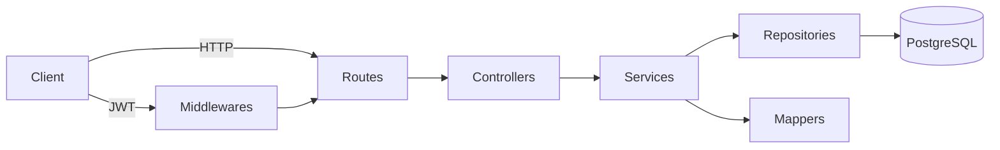

## API de Pedidos - Desafio Técnico Jitterbit

### Visão geral

Esta aplicação implementa uma **API REST** em Node.js para gestão de pedidos, conforme o desafio técnico da Jitterbit.  
Ela recebe o JSON de entrada no formato do desafio, realiza o **mapeamento de campos** e persiste os dados em um banco **PostgreSQL**.

Principais endpoints:

- **POST** `/auth/login` – autenticação e obtenção de token JWT.
- **POST** `/order` – criar pedido (protegido por JWT).
- **GET** `/order/:numeroPedido` – buscar pedido por número.
- **GET** `/order/list` – listar pedidos.
- **PUT** `/order/:numeroPedido` – atualizar pedido (protegido por JWT).
- **DELETE** `/order/:numeroPedido` – remover pedido (protegido por JWT).
- **GET** `/health` – health-check.
- **GET** `/docs` – documentação Swagger da API.

### Arquitetura (camadas)

A API segue uma arquitetura em camadas simples:

- **Rotas (`routes`)**: definem os endpoints HTTP e delegam para os controllers (ex.: `order.routes.js`, `auth.routes.js`).
- **Middlewares (`middlewares`)**: responsabilidades transversais, como autenticação JWT (`auth.js`) e tratamento de erros (`error-handler.js`).
- **Controllers (`controllers`)**: recebem `req/res`, chamam os services e convertem o retorno em respostas HTTP.
- **Services (`services`)**: contêm a lógica de negócio (validações de domínio, regras de conflito, etc.).
- **Mappers (`mappers`)**: fazem o mapeamento entre JSON de entrada, modelo de domínio, modelo de persistência e formato de saída.
- **Repositórios (`repositories`)**: encapsulam o acesso ao banco de dados usando Knex.
- **Config (`config`)**: configurações de ambiente, banco de dados e afins.

Alguns arquivos importantes para navegação no código:

- `src/app.js` – configuração do Express, middlewares e Swagger.
- `src/server.js` – bootstrap da aplicação (subida e encerramento do servidor).
- `src/routes/order.routes.js` – rotas de pedidos.
- `src/routes/auth.routes.js` – rotas de autenticação.
- `src/controllers/order.controller.js` – orquestração das operações de pedidos.
- `src/services/order.service.js` – regras de negócio de pedidos.
- `src/repositories/order.repository.js` – acesso ao banco de dados de pedidos.
- `src/mappers/order.mapper.js` – mapeamento entre JSON de entrada/saída e modelo interno.
- `src/middlewares/auth.js` – autenticação JWT.
- `src/middlewares/error-handler.js` – tratamento centralizado de erros.

Diagrama simplificado do fluxo principal:



### Stack utilizada

- **Runtime**: Node.js
- **Framework HTTP**: Express
- **Banco de dados**: PostgreSQL
- **ORM/Query Builder**: Knex
- **Autenticação**: JWT (`jsonwebtoken`)
- **Documentação**: Swagger (`swagger-ui-express`)
- **Testes**: Jest + Supertest
- **Lint/Format**: ESLint + Prettier

### Execução rápida

#### Com Docker

1. Copie `.env.example` para `.env` e ajuste as variáveis de ambiente, se necessário.
2. Suba os serviços com:

```bash
docker compose up -d
```

3. Rode as migrações dentro do container da API:

```bash
docker compose exec api npm run db:migrate
```

4. Valide rapidamente:
   - `http://localhost:3000/health` – API saudável.
   - `http://localhost:3000/docs` – documentação Swagger para testar os endpoints.

#### Sem Docker

1. Copie `.env.example` para `.env` e configure o acesso ao PostgreSQL local.
2. Instale as dependências:

```bash
npm install
```

3. Execute as migrações:

```bash
npm run db:migrate
```

4. Inicie a API em modo desenvolvimento:

```bash
npm run dev
```

5. Acesse:
   - `http://localhost:3000/health`.
   - `http://localhost:3000/docs`.

### Pré-requisitos

- Node.js (>= 18)
- npm (>= 9)
- Docker e Docker Compose (opcional, mas recomendado)

### Configuração de ambiente

1. Copie o arquivo de exemplo:

```bash
cp .env.example .env
```

2. Ajuste as variáveis conforme necessário:

- **PORT**: porta HTTP da API (padrão `3000`).
- **DB_HOST**, **DB_PORT**, **DB_USER**, **DB_PASS**, **DB_NAME**: configurações do PostgreSQL.
- **JWT_SECRET**, **JWT_EXPIRES_IN**: segredo e tempo de expiração do JWT.

> Importante: nunca faça commit de arquivos `.env` com credenciais reais.

### Executando localmente (sem Docker)

1. Instale as dependências:

```bash
npm install
```

2. Garanta que o PostgreSQL esteja rodando e acessível com as credenciais configuradas em `.env`.

3. Execute as migrações:

```bash
npm run db:migrate
```

4. Inicie a API em modo desenvolvimento:

```bash
npm run dev
```

A API ficará disponível em `http://localhost:3000`.

### Executando com Docker Compose

O projeto inclui um `docker-compose.yml` que sobe:

- **db**: container com PostgreSQL.
- **api**: container com a API Node.js, usando o código desta pasta.

1. Garanta que a porta `3000` (API) e `5432` (Postgres) estejam livres no host.

2. Suba os serviços:

```bash
docker compose up -d
```

3. A API ficará disponível em:

- `http://localhost:3000/health` – health-check.
- `http://localhost:3000/docs` – documentação Swagger.

4. Rode as migrações dentro do container da API (após os serviços estarem de pé):

```bash
docker compose exec api npm run db:migrate
```

Se precisar desfazer e recriar as migrações do zero:

```bash
docker compose exec api npm run db:reset
```

Para acompanhar logs:

```bash
docker compose logs -f api
docker compose logs -f db
```

Para parar e remover os containers (mantendo o volume de dados):

```bash
docker compose down
```

Para também remover o volume de dados do banco:

```bash
docker compose down -v
```

### Fluxo de autenticação (JWT)

1. **Login** para obter token:

```bash
curl --location 'http://localhost:3000/auth/login' \
  --header 'Content-Type: application/json' \
  --data '{
    "username": "admin",
    "password": "admin"
  }'
```

Resposta esperada:

```json
{
  "token": "eyJhbGciOiJIUzI1NiIsInR5cCI6IkpXVCJ9...",
  "tokenType": "Bearer"
}
```

2. Use o token JWT retornado no cabeçalho `Authorization` das rotas protegidas (`POST /order`, `PUT /order/:numeroPedido`, `DELETE /order/:numeroPedido`):

```bash
Authorization: Bearer <token>
```

### Uso da API (exemplos de chamadas)

#### Criar pedido (`POST /order`)

```bash
curl --location 'http://localhost:3000/order' \
  --header 'Content-Type: application/json' \
  --header 'Authorization: Bearer <token>' \
  --data '{
    "numeroPedido": "v10089015vdb-01",
    "valorTotal": 10000,
    "dataCriacao": "2023-07-19T12:24:11.5299601+00:00",
    "items": [
      {
        "idItem": "2434",
        "quantidadeItem": 1,
        "valorItem": 1000
      }
    ]
  }'
```

O formato de resposta segue o **formato de destino** definido no desafio:

```json
{
  "orderId": "v10089015vdb-01",
  "value": 10000,
  "creationDate": "2023-07-19T12:24:11.529Z",
  "items": [
    {
      "productId": 2434,
      "quantity": 1,
      "price": 1000
    }
  ]
}
```

#### Buscar por número (`GET /order/:numeroPedido`)

```bash
curl --location 'http://localhost:3000/order/v10089015vdb-01'
```

#### Listar pedidos (`GET /order/list`)

```bash
curl --location 'http://localhost:3000/order/list'
```

#### Atualizar pedido (`PUT /order/:numeroPedido`)

```bash
curl --location --request PUT 'http://localhost:3000/order/v10089015vdb-01' \
  --header 'Content-Type: application/json' \
  --header 'Authorization: Bearer <token>' \
  --data '{
    "numeroPedido": "v10089015vdb-01",
    "valorTotal": 12000,
    "dataCriacao": "2023-07-19T12:24:11.5299601+00:00",
    "items": [
      {
        "idItem": "2434",
        "quantidadeItem": 2,
        "valorItem": 6000
      }
    ]
  }'
```

#### Deletar pedido (`DELETE /order/:numeroPedido`)

```bash
curl --location --request DELETE 'http://localhost:3000/order/v10089015vdb-01' \
  --header 'Authorization: Bearer <token>'
```

### Testes

Esta aplicação utiliza **Jest + Supertest** para testes automatizados, cobrindo principalmente:

- **Mapeadores de pedidos** (`order.mapper`): conversão do JSON de entrada do desafio para o modelo de domínio, modelo de persistência e JSON de saída (formato de destino).
- **Rotas principais** de autenticação e pedidos:
  - `POST /auth/login`.
  - `POST /order`, `GET /order/:numeroPedido`, `GET /order/list`, `PUT /order/:numeroPedido`, `DELETE /order/:numeroPedido`.
- **Regras de negócio principais** exercitadas pelas rotas:
  - Criação sem duplicidade de `orderId`.
  - Busca/atualização/remoção com tratamento adequado de erros (`400`, `401`, `404`, `409`).
  - Validação de consistência do `numeroPedido` entre path e body no `PUT`.

#### Rodando testes localmente (sem Docker)

1. Garanta que as dependências estejam instaladas:

```bash
npm install
```

2. Garanta que o banco configurado em `.env` (ou `.env.test`, se você tiver configurado um ambiente específico de teste) esteja acessível.

3. Execute a suíte de testes:

```bash
npm test
```

Os testes de integração assumem um banco de dados limpo para evitar interferência com outros dados. Não execute a suíte de testes apontando para um banco de produção.

#### Rodando testes com Docker Compose

Com os serviços `db` e `api` já no ar (por exemplo, após `docker compose up -d`):

```bash
docker compose exec api npm test
```

O comando acima executa a mesma suíte de testes dentro do container da API, utilizando o banco configurado no `docker-compose.yml` (idealmente um banco/schema de teste separado).

### Documentação da API (Swagger)

Após subir a aplicação, acesse:

- `http://localhost:3000/docs`

Lá você encontra a descrição dos endpoints, contratos de entrada/saída e exemplos de uso.

### Coleção Postman

Este repositório inclui a coleção `postman_collection.json` na raiz do projeto, com todos os endpoints configurados:

- `Auth - Login` – realiza o login com `admin/admin` e salva automaticamente o token em `jwtToken`.
- Demais requisições de pedidos (`Create`, `Get by Id`, `List`, `Update`, `Delete`) já utilizam o header `Authorization: Bearer {{jwtToken}}`.

Para usar:

1. Abra o Postman e clique em **Import**.
2. Selecione o arquivo `postman_collection.json` na raiz do projeto.
3. Garanta que a variável `baseUrl` esteja definida como `http://localhost:3000` (já vem assim por padrão).
4. Execute primeiro a requisição **Auth - Login** para popular `jwtToken`.
5. Use as requisições de pedidos para criar, listar, buscar, atualizar e deletar pedidos rapidamente.

### Checklist para o avaliador

Este checklist resume os passos recomendados para validar rapidamente a solução de ponta a ponta.

1. **Preparar o ambiente**: clonar o repositório e entrar na pasta do projeto.
2. **Subir a aplicação**:
   - **Com Docker**: seguir a seção **Execução rápida > Com Docker**.
   - **Sem Docker**: seguir a seção **Execução rápida > Sem Docker**.
3. **Verificar saúde da API**: acessar `http://localhost:3000/health`.
4. **Abrir a documentação Swagger**: acessar `http://localhost:3000/docs` para visualizar e testar os endpoints.
5. **(Recomendado) Importar a coleção Postman**:
   - Importar `postman_collection.json` conforme a seção **Coleção Postman**.
   - Garantir que `baseUrl = http://localhost:3000` e executar **Auth - Login** para popular `jwtToken`.
6. **Autenticar**: fazer login em `POST /auth/login` (Swagger ou Postman) usando `admin/admin` e obter o token JWT.
7. **Criar pedido**: enviar um pedido em `POST /order` usando o JSON de entrada do enunciado.
8. **Consultar pedidos**: listar em `GET /order/list` e buscar pelo número em `GET /order/:numeroPedido`.
9. **(Opcional) Atualizar e deletar**: atualizar (`PUT /order/:numeroPedido`) e deletar (`DELETE /order/:numeroPedido`) um pedido existente.
10. **Validar mapeamento de dados**: conferir que o JSON de resposta está no formato de destino especificado no desafio (campos `orderId`, `value`, `creationDate`, `items.productId`, `items.quantity`, `items.price`).
